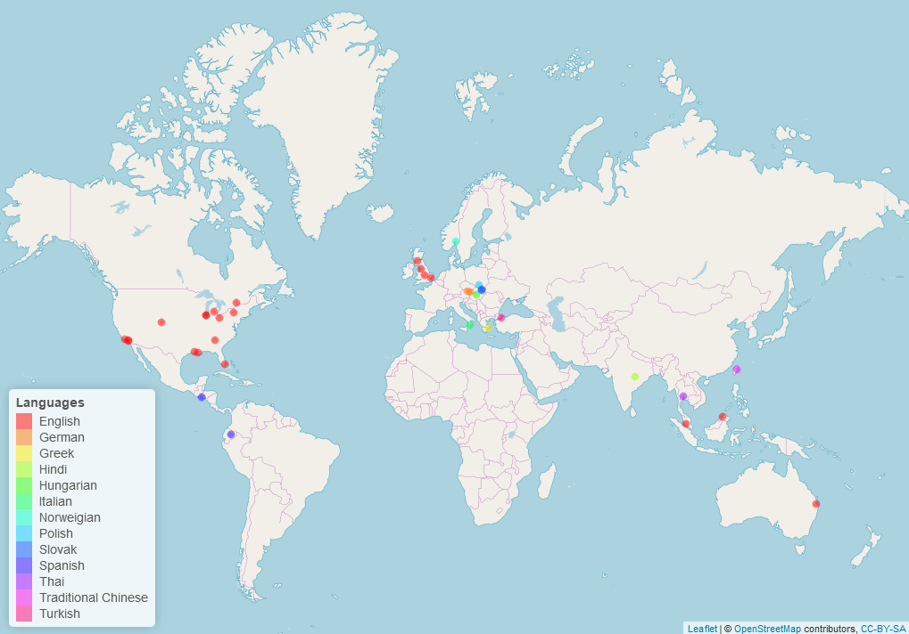

```{r setup, include=FALSE}
knitr::opts_chunk$set(echo = FALSE)
```


**Note** The data collection was finished at June 16, 2021. This website is going to be updated with the data analysis and the writings on the report. 

```{r global, echo=FALSE, message=FALSE, warning=FALSE, fig.cap=""}

```
