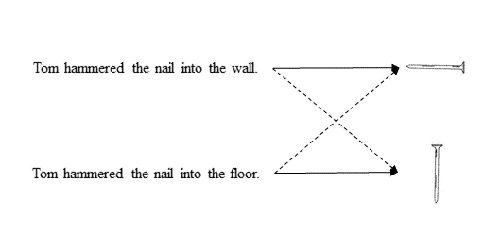

```{r setup, include=FALSE}
knitr::opts_chunk$set(echo = FALSE)
```


### Research Questions

This study investigated in which language the match advantage of object orientations (a.k.a. orientation effect) would be detected in the sentence-picture verification task. 

```{r example, echo=FALSE, message=FALSE, warning=FALSE, fig.cap="Example of matching (solid lines) and mismatching (dashed lines) sentence-picture pairs."}

```

The orientation effects have been suggested as the empirical evidence of mental simulations. Several theoretical assumptions about the mental simulations have yet been settled. To one extend, the mental simulation was the part of language processing [ @barsalouPerceptualSymbolSystems1999; @barsalouSimulationSituatedConceptualization2009]. To the other extend, the mental rotation mechanisms would boost the mental simulation [@chuSpontaneousGesturesMental2008; @pouwMoreEmbeddedExtended2014]. 


We addressed two primary questions in our plan:

1. How much of the match advantage of object orientation can be obtained within different languages? 

2. What is the correlation between the mental rotation of objects and the match advantage across different languages? 

### Hypothesis

1. If the orientation effect is a general result, in every language we would detect this effect.

2. We have no specific expect for the effect in some language.

3. Imagery scores were the measures of mental rotation. We expect the equal imagery scores across the laboratories. 

4. "If the mental simulation shared the cognitive processing of mental rotation, the imagery scores could be the predictor as critical as the languages."
