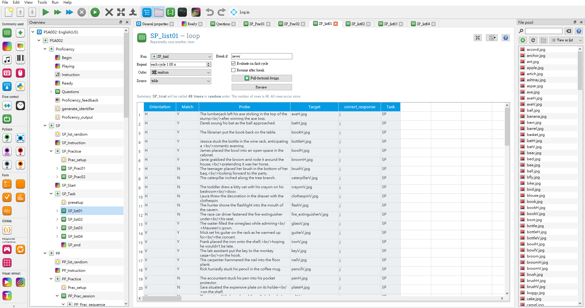

```{r setup, include=FALSE}
knitr::opts_chunk$set(echo = FALSE)
```

https://osf.io/74ujf/

### Scripts

All the scripts for final data collection turn are available on this [OSF page](https://osf.io/e428p/). Check the directories **Materials -> js**. Download the script you require. 

You would extract the materials from OpenSesame GUI. As like the below figure.

```{r OS_GUI, fig.width=500, message=FALSE, warning=FALSE, fig.cap="File pool browser on the right side show all the picture files. Probe sentences sheet are in the loop on the middle part. Experimenters could edit them directly."}


```


### Sentences

In [this excel file](https://osf.io/utqxb/), we summarized all the English and Chinese sentences for this experiment. When replicators will revise the probe sentences, this excel file help you manage the sheet in the "loop" item. The probe sentences in the above figure were from the "ENG_LIST1" in this excel file.

### Pictures

The target pictures are available at [here](https://osf.io/dwnb4/). Download the zip file and check them in your own device. If you would like the replace the picture, it is recommended to find the pictures as equal size as the original files.

